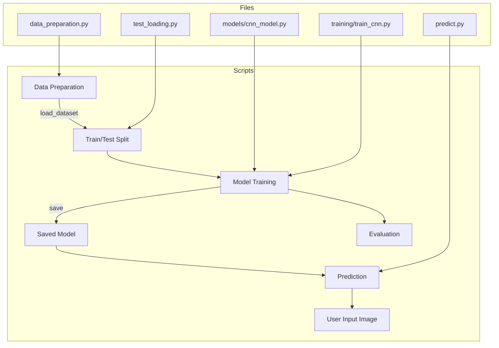

# Architecture Diagram (Mermaid)

```mermaid
graph TD
    A[Data Preparation] -->|load_dataset| B[Train/Test Split]
    B --> C[Model Training]
    C -->|save| D[Saved Model]
    D --> E[Prediction]
    E --> F[User Input Image]
    C --> G[Evaluation]
    subgraph Scripts
        A
        B
        C
        D
        E
        F
        G
    end
    subgraph Files
        H[data_preparation.py]
        I[models/cnn_model.py]
        J[training/train_cnn.py]
        K[predict.py]
        L[test_loading.py]
    end
    H --> A
    I --> C
    J --> C
    K --> E
    L --> B
```
